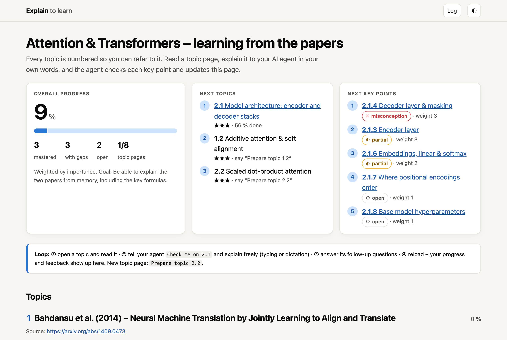

# Explain to learn

**Learn anything by explaining it to an AI agent. It checks every point and tracks your progress on a small local website.**

Reading feels like learning, but you only really know a topic once you can explain it. This repo turns that into a loop:

1. **Read** a topic page with a short summary, interactive diagrams and formulas.
2. **Explain** the topic in your own words to your AI agent. Typing works; dictation (e.g. Wispr Flow) is faster.
3. **Get checked.** The agent grades every key point (*mastered / partial / misconception / open*), asks follow-up questions about the gaps and tells you what to fix.
4. **See your progress.** The website shows progress bars per topic and what to learn next.



The example content covers two public papers: [Attention Is All You Need](https://arxiv.org/abs/1706.03762) and [Bahdanau et al. 2014](https://arxiv.org/abs/1409.0473). One topic page is fully built ([2.1 Model architecture](site/topics/2.1-model-architecture.html)); the agent creates the others when you ask.

## Quick start

You need an AI coding agent that can read and edit files, for example [Claude Code](https://claude.com/claude-code). It reads `CLAUDE.md` → `AGENTS.md` automatically; other agents read `AGENTS.md`.

```bash
git clone <this repo> && cd attention-explain-to-learn
open site/index.html          # or double-click it – no server, no build
claude                        # start your agent in the repo
```

Then just talk to it:

| Say | What happens |
|---|---|
| `Check me on 2.1` | You explain, it grades each key point, asks follow-ups, saves the result |
| `Prepare topic 2.2` | It reads the source and builds a new topic page with key points |
| `Explain 2.1.4 again` | Answers questions; topics and key points are numbered |
| `What should I learn next?` | Suggests topics based on importance and your gaps |

Reload the page after a check to see the new state.

## Make it yours

Everything is plain files, so you can adapt anything. Just ask your agent:

- **Your own subject:** put lecture slides, papers or notes into `sources/` (git-ignored) and say *"Replace the topics with my course from `sources/`"*.
- **Your own rules:** edit [`AGENTS.md`](AGENTS.md), e.g. how strict the grading is, how many follow-up questions it asks, or what a topic page must contain.
- **Your own look:** pages are HTML/CSS/JS without dependencies. Ask for new diagrams, a quiz mode, or a different layout.

Your progress lives in one file: [`site/data/progress.js`](site/data/progress.js).

## Copyright

The papers are linked, not included. `sources/fetch-papers.sh` downloads them from arXiv for local use. All explanations and diagrams in `site/` are original. Code: MIT.
